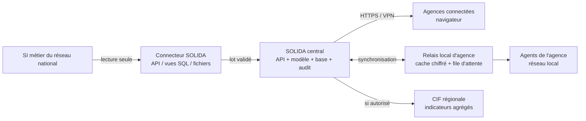

# Connectivité faible et connecteur de données réel

## Statut du document

Ce document fixe l'architecture cible retenue pour traiter deux limites du prototype :

1. le fonctionnement lorsque la connexion d'une agence est lente ou interrompue ;
2. le raccordement de SOLIDA au logiciel de gestion réel d'un réseau national.

Il distingue explicitement ce qui existe aujourd'hui, ce qui doit être démontré pendant le
hackathon et ce qui relève d'un pilote avec une coopérative. Les seuils de fraîcheur, les droits
accordés hors connexion et le format du SI source restent des décisions à valider avec le réseau
pilote ; aucune valeur n'est inventée ici.

## Sources vérifiées

- **TDR officiel** (`tdr-appel-a-candidatures-global-hackathon-cif-digicoop-wa-2026.pdf`,
  page 4) : Pertinence 30 %, Originalité 20 %, Faisabilité technique et réalisme du plan de
  développement 20 %, Impact potentiel 15 %, Complémentarité de l'équipe 15 %. La copie de la
  pièce d'identité du chef d'équipe est une pièce obligatoire du dossier.
- **Q&A officielle du hackathon** (`reponses-hackathon.pdf`) :
  - Q6.1 : les caisses d'un même réseau utilisent le même logiciel, mais les logiciels diffèrent
    selon les pays ; SOLIDA ne doit donc pas supposer une interface unique pour toute la CIF ;
  - Q6.2 : API, export de fichiers et accès en lecture seule sont tous envisageables ;
  - Q6.3 : aucun dictionnaire ni exemple de données n'est fourni ;
  - Q6.4 : l'identifiant d'un client est obtenu par combinaison du code caisse, du code agence et
    du numéro incrémental ; cette règle devra être confirmée dans le pilote avant d'être utilisée ;
  - Q10.1, Q12.3, Q16.1 et Q17.1 : aucune donnée réelle du réseau CIF ne sera fournie ; les
    équipes travaillent sur des données synthétiques, simulées ou publiques clairement identifiées ;
  - Q11.6 : la solution doit fonctionner sur Android ou Windows, prévoir un mode dégradé en cas
    de faible connectivité et rester compatible avec des interfaces simples ; le fonctionnement
    totalement hors ligne et l'USSD sont possibles ou envisageables, mais ne sont pas imposés ;
  - Q10.3 mentionne un « espace cloud partagé », tandis que Q17.3 précise qu'aucun serveur,
    hébergement ou base de données ne sera fourni et demande de privilégier une solution locale.
    Cette contradiction interdit de dépendre de l'environnement de l'organisateur pour la
    démonstration.
- **Sources publiques CIF/FUCEC consultées le 13/08/2026** : la CIF regroupe plusieurs réseaux
  nationaux et la FUCEC-Togo exploite de nombreux points de service ainsi que des services
  numériques synchronisés. Les sources publiques ne décrivent toutefois pas la topologie interne
  exacte du SI ; elle devra être confirmée par la direction informatique du réseau pilote.

## Ce que signifie « manque de connexion »

Quatre situations différentes ne doivent pas être confondues.

| Situation | Exemple | Effet sans protection |
|---|---|---|
| Internet externe indisponible | Le site n'accède plus au cloud ou au tunnel public | Aucun effet si toute la pile SOLIDA est installée sur le réseau local |
| Liaison agence-siège lente | Débit faible ou instable | Interface lente, requêtes interrompues et doubles soumissions possibles |
| Liaison agence-siège coupée | Une agence rurale ne joint plus le serveur central | L'agence ne peut plus consulter ni transmettre une demande sans relais local |
| SI métier indisponible | Le logiciel de gestion ne répond plus, mais SOLIDA reste accessible | SOLIDA ne peut plus charger les données si aucun instantané n'existe |

Le **mode dégradé** ne signifie pas que toutes les fonctions restent disponibles. Il signifie que
SOLIDA continue les opérations explicitement autorisées, indique l'âge des données et bloque une
décision lorsque les informations ne sont plus suffisamment fiables.

## État réel du prototype

| Capacité | État actuel |
|---|---|
| Exécution locale | La pile Docker complète est accessible sur `http://localhost`. Après construction des images, elle ne dépend pas d'Internet pour fonctionner sur la machine hôte. |
| Accès depuis Android/Windows | L'interface web peut être ouverte depuis un navigateur ; l'accès depuis un autre appareil du réseau local reste à configurer et à tester explicitement. |
| Données | `postgres-coresim` est une base simulée, pas le SI d'une coopérative réelle. |
| Lecture du SI | `LecteurCoreSimPostgres` lit directement CORE-SIM avec un compte en lecture seule. |
| Substitution du connecteur | Le port structurel `LecteurCoreSim` expose neuf méthodes de lecture et permet une autre implémentation sans modifier le domaine. |
| Feature store | Les variables sont calculées à la demande depuis CORE-SIM ; aucun instantané historisé ni batch de consolidation n'existe. |
| Fraîcheur | `date_dernier_rafraichissement` renvoie actuellement `date.today()` et ne mesure pas une vraie synchronisation. |
| Repli des modèles | Un seul `ModeleConstant` existe. Le repli du modèle enrichi vers le socle en cas de panne n'est pas encore implémenté. |
| Frontend hors connexion | Aucun cache métier, relais local ou file de synchronisation n'existe. |
| Erreurs explicites | Des erreurs domaine existent, mais les indisponibilités techniques de CORE-SIM et du modèle ne sont pas encore toutes converties en réponses métier stables. |

Le prototype est donc **local et autonome vis-à-vis d'Internet sur une machine**, mais il n'est pas
encore **résilient entre plusieurs agences** et ne continue pas à scorer si sa source CORE-SIM
devient indisponible.

## Architecture de déploiement retenue

SOLIDA reste un monolithe modulaire conteneurisé. Il n'y a pas de justification pour introduire des
microservices ou une infrastructure cloud lourde.

La cible est :

- une installation centrale par **réseau national**, par exemple FUCEC-Togo ;
- un accès normal par navigateur depuis les agences via HTTPS sur le réseau privé ou un VPN ;
- un relais local uniquement dans les agences où les coupures le justifient ;
- aucune centralisation automatique des dossiers individuels au niveau régional de la CIF ;
- des indicateurs agrégés et anonymisés transmis à la CIF uniquement après validation de la
  gouvernance correspondante.



### Pourquoi ne pas installer toute la plateforme dans chaque agence ?

Une installation complète et indépendante par agence multiplierait les bases, les sauvegardes, les
versions de modèle, les mises à jour et les conflits de synchronisation. Le relais local ne contient
que le sous-ensemble nécessaire à son agence et reste subordonné au serveur central.

| Option | Coût relatif | Résilience | Décision |
|---|---:|---:|---|
| Serveur central uniquement | Faible | Faible lors d'une coupure agence-siège | Suffisant pour la démonstration, insuffisant pour les agences durablement mal connectées |
| Serveur central + relais dans les agences fragiles | Modéré | Élevée | **Cible retenue** |
| Plateforme complète dans chaque agence | Très élevé | Complexité opérationnelle forte | À éviter |
| Cloud public unique | Variable | Dépendance à Internet | Non retenu comme architecture obligatoire |

Aucun montant n'est donné sans inventaire du matériel existant, mesure de la connectivité et
nombre d'agences à équiper. Le principe d'économie est de n'installer un relais que là où les
coupures sont effectivement constatées.

## Comportement retenu pendant une coupure d'agence

Pour le premier pilote, le relais local d'agence permet :

- la recherche d'un sociétaire déjà synchronisé ;
- la consultation de son dossier local ;
- la préparation et l'enregistrement d'un brouillon de demande ;
- le placement de la demande dans une file d'attente ;
- l'affichage permanent de la date et de l'état de la dernière synchronisation.

Il ne permet pas, pendant le premier pilote :

- la création d'un nouvel utilisateur ;
- la modification de la politique de crédit ;
- la confirmation définitive d'un octroi sans revalidation centrale.

Une prévisualisation locale du score n'est autorisable que si le relais possède la version validée
du modèle, de la grille et des variables, et si leur fraîcheur respecte un seuil validé par la
coopérative. Ce seuil n'est pas encore tranché.

### Stockage local

Les données métier ne sont jamais stockées dans `localStorage` ou `sessionStorage`. Elles vivent
sur un relais d'agence administré, avec :

- disque chiffré ;
- données limitées à l'agence ;
- comptes individuels et permissions minimales ;
- journal local synchronisable ;
- expiration des copies devenues trop anciennes ;
- procédure de remplacement ou d'effacement en cas de perte du matériel.

Un relais géré par la coopérative reste dans son périmètre et respecte la souveraineté des données.
Il ne nécessite aucune exception à l'interdiction du stockage métier dans le navigateur.

### Reprise et conflits

Chaque demande créée hors connexion reçoit un identifiant unique et une clé d'idempotence. Au
retour du réseau :

1. le relais transmet les demandes dans leur ordre de création ;
2. le serveur central rejette les doublons sans reproduire l'opération ;
3. il vérifie si le dossier ou les crédits du sociétaire ont changé ;
4. une demande sans conflit est enregistrée ;
5. une demande devenue incompatible est envoyée en vérification humaine ;
6. le relais conserve l'élément jusqu'à réception de l'accusé central.

Aucune version locale ne remplace silencieusement une version centrale.

## Options avancées de fonctionnement dégradé

Ces options sont techniquement possibles, mais elles ne sont pas toutes requises pour le hackathon
national. Elles sont classées par maturité afin de ne pas confondre cible et état actuel.

### Option avancée A — scoring complet hors connexion

Le relais d'agence peut calculer le score sans joindre le siège s'il possède localement :

- un instantané validé des variables de l'agence ;
- le modèle entraîné et calibré, avec son identifiant et son empreinte ;
- la grille de décision et les plafonds applicables ;
- la date de fraîcheur de chaque composant ;
- les règles d'arrêt lorsque l'un des composants est absent ou périmé.

Le résultat doit indiquer qu'il a été calculé hors connexion et conserver les versions exactes du
modèle, de la grille et des données. Cette option permet une prévisualisation locale, mais ne suffit
pas à autoriser une confirmation définitive.

### Option avancée B — confirmation d'un octroi hors connexion

Cette option ajoute un risque plus élevé : le siège peut avoir enregistré entre-temps un nouveau
crédit, bloqué un compte, révoqué un agent ou activé une nouvelle politique. Elle n'est autorisable
qu'après validation explicite des points suivants :

- durée maximale de validité des données ;
- montant maximal confirmable hors connexion ;
- produits éligibles et situations toujours renvoyées au comité ;
- durée et droits d'une session hors connexion ;
- journal local infalsifiable et horodatage fiable ;
- revalidation automatique au retour du réseau ;
- procédure humaine lorsqu'une décision locale entre en conflit avec l'état central.

Aucun de ces seuils n'est fixé dans les documents de référence. L'option reste donc interdite dans
le premier pilote.

### Option avancée C — distribution sécurisée du modèle et de la politique

Le serveur central peut distribuer aux relais un paquet versionné contenant le modèle, la grille,
le catalogue des variables et leurs empreintes. Un relais n'active le paquet qu'après vérification,
conserve la version précédente pour retour arrière et refuse tout paquet incomplet. Le siège doit
pouvoir connaître la version active dans chaque agence.

### Option avancée D — synchronisation multi-source

Un réseau peut disposer de plusieurs sources : logiciel de crédit, épargne, mobile money ou fichiers
de groupes. SOLIDA peut les consolider dans une zone de réception commune, à condition que chaque
source ait une autorité clairement définie, un point de reprise et des règles de rapprochement. Cette
option ne doit pas être construite avant l'inventaire du SI pilote.

### Option avancée E — interface USSD

L'USSD est envisageable selon Q11.6, mais il n'est pas adapté à l'explication complète d'un score ni
à la consultation d'un dossier sensible. Une extension future pourrait limiter l'USSD au statut
d'une demande, à un accusé de réception ou à une information non sensible. Le parcours principal
reste l'interface web sur Android ou Windows.

### Option avancée F — haute disponibilité centrale

Après mesure du pilote, le serveur central peut recevoir une sauvegarde automatisée, une machine de
reprise et une procédure de bascule testée. Un cluster complexe n'est pas justifié avant de connaître
la charge, l'objectif de reprise et les capacités de l'équipe d'exploitation.

## Connecteur de données réel

L'absence de données CIF interdit de prétendre avoir validé un raccordement réel. Elle n'empêche
pas de démontrer un contrat d'intégration complet sur un export synthétique.

### Ordre de préférence

1. **API en lecture seule**, lorsque le logiciel du réseau en fournit une ;
2. **vues SQL ou réplique en lecture seule**, limitées aux données nécessaires ;
3. **exports CSV chiffrés déposés sur SFTP**, lorsqu'aucune interface temps réel n'existe.

SOLIDA n'écrit jamais directement dans le SI métier. Une éventuelle restitution d'une décision
vers ce SI devra faire l'objet d'un flux distinct, explicitement autorisé et audité.

### Pipeline d'intégration cible

```text
Réception d'un lot
    ↓
Contrôle de la version et de l'origine
    ↓
Validation des identifiants, dates, montants et relations
    ↓
Quarantaine des lignes invalides
    ↓
Correspondance vers le schéma SOLIDA
    ↓
Calcul des variables
    ↓
Publication atomique d'un nouvel instantané
```

L'ancien instantané reste actif tant que le nouveau lot n'est pas entièrement validé. Une
importation partielle ne remplace jamais les données précédentes.

Chaque synchronisation doit conserver :

- la source et sa version ;
- l'heure de réception et la période couverte ;
- le nombre de lignes reçues, acceptées et rejetées ;
- l'empreinte du fichier ou du lot ;
- le point de reprise de la synchronisation ;
- le résultat des validations ;
- la date réelle du dernier instantané publié.

### Fréquence cible

- synchronisation incrémentale pendant la journée si la source le permet ;
- consolidation complète nocturne ;
- rapprochement périodique entre les volumes du SI source et ceux de SOLIDA ;
- maintien de l'ancien instantané et alerte lorsque le nouveau lot échoue.

Les fréquences exactes restent à confirmer avec le SI pilote. L'interface affiche toujours la date
de fraîcheur au lieu de laisser croire que les données sont actuelles.

## Plan de réalisation

### Hackathon national — preuve de faisabilité

L'objectif national n'est pas de construire toute l'infrastructure multi-agence. Il est de prouver
que l'architecture est locale, légère, explicable et préparée aux coupures.

#### À construire

1. Déclarer SOLIDA en **Track B — adaptation d'un prototype préexistant**.
2. Démontrer le lancement local de la pile sur Windows sans dépendre d'Internet après
   installation des images.
3. Vérifier l'affichage sur un navigateur Android relié au même réseau local.
4. Construire un import CSV de référence sur données synthétiques, avec version du format,
   validation, quarantaine, rapport d'erreurs, détection des doublons et empreinte du lot.
5. Construire un véritable instantané de variables avec la source, la date de production et la
   date de publication.
6. Faire lire le scoring depuis cet instantané plutôt que directement depuis CORE-SIM.
7. Afficher dans l'interface l'état de connexion, la source et la dernière synchronisation.
8. Convertir les indisponibilités de la source et du modèle en comportements explicites : repli
   autorisé ou refus de scorer, jamais une erreur technique brute.
9. Simuler une demande mise en attente et montrer les statuts de synchronisation, même si le
   relais intersites complet n'est pas encore construit.
10. Documenter le déploiement central par réseau national et le relais sélectif d'agence.

#### Scénario de démonstration

1. importer un lot synthétique et montrer son rapport ;
2. rechercher un sociétaire et calculer un score ;
3. afficher la date et la source des données ;
4. arrêter CORE-SIM ;
5. montrer que SOLIDA utilise l'instantané encore valide ;
6. simuler une donnée périmée et montrer que le score est bloqué ou dégradé explicitement ;
7. couper Internet tout en gardant la pile locale et montrer que l'application reste accessible ;
8. présenter la trajectoire vers le relais d'agence sans prétendre qu'il est déjà opérationnel.

#### Critère de réussite national

Le jury doit voir une application utilisable sur un poste standard, un contrat d'intégration
démontré, une fraîcheur réelle, une coupure simulée et un comportement sûr. La confirmation
définitive hors connexion et le raccordement à un vrai SI ne sont pas revendiqués.

### Quatre semaines de préparation avant le hackathon régional

Le TDR prévoit un accompagnement technique de quatre semaines pour le lauréat national. Cette
période sert à transformer la preuve locale en prototype multi-site testable.

1. Construire un relais d'agence minimal avec base locale chiffrée et données limitées à une
   agence fictive.
2. Implémenter la synchronisation descendante des dossiers et la remontée des brouillons.
3. Ajouter identifiants uniques, idempotence, accusés de réception, reprises et file persistante.
4. Simuler un conflit : nouvelle information centrale pendant que l'agence est coupée, puis
   passage en vérification humaine.
5. Distribuer au relais un paquet de modèle et de grille versionné, puis vérifier son empreinte.
6. Tester une prévisualisation de score hors connexion, sans confirmation définitive.
7. Tester le parcours sur Windows et Android via le réseau local de l'agence.
8. Ajouter un tableau de supervision : agences synchronisées, retard, files en attente, erreurs et
   versions actives.
9. Documenter sauvegarde, restauration, perte d'un relais et retour à la version précédente.
10. Préparer avec les mentors le contrat de pilote : données minimales, responsabilités, sécurité,
    mesures de succès et décisions de gouvernance attendues.

### Hackathon régional — preuve multi-site et trajectoire pilote

#### À démontrer

1. Un serveur central SOLIDA représentant un réseau national.
2. Une agence connectée utilisant normalement le serveur central.
3. Une agence rurale utilisant un relais local.
4. Une coupure réseau réelle entre le relais et le central.
5. La consultation locale et la création d'un brouillon pendant la coupure.
6. Une prévisualisation hors connexion portant clairement les versions et la fraîcheur utilisées.
7. Le retour du réseau, la synchronisation, la déduplication et l'accusé central.
8. Un conflit volontaire envoyé en revue humaine, sans écrasement silencieux.
9. Le tableau de supervision des agences et de la fraîcheur.
10. Le plan de raccordement API, vues SQL ou CSV/SFTP pour une coopérative pilote.

#### Option avancée pour le régional

Si les conditions de gouvernance sont obtenues pendant le mentorat, la démonstration peut inclure
une confirmation hors connexion limitée à un environnement fictif. Elle doit être présentée comme
une simulation de capacité technique, jamais comme une politique CIF déjà approuvée.

#### Critère de réussite régional

Le jury doit voir la transition complète « central disponible → coupure → travail local autorisé →
retour du réseau → réconciliation », avec traçabilité et sans perte ni double demande.

### Pilote avec un réseau national

1. Inventorier le SI, les interfaces disponibles et la qualité réelle de la connectivité.
2. Installer SOLIDA au siège du réseau et raccorder une source en lecture seule.
3. Piloter une agence normalement connectée et une agence rurale équipée d'un relais.
4. Autoriser hors connexion la consultation et les brouillons, sans confirmation définitive.
5. Mesurer les coupures, retards de synchronisation, erreurs de données et conflits.
6. Tester sauvegarde, restauration et remplacement d'un relais.
7. Faire valider par la direction des risques la fraîcheur, les montants, les produits et les
   actions autorisables hors connexion.

### Après le pilote

- étendre progressivement les relais aux seules agences qui en ont besoin ;
- distribuer un modèle entraîné, calibré, validé et versionné ;
- n'autoriser le scoring complet ou la confirmation hors connexion qu'après validation des règles
  de fraîcheur, de montant, de produit, d'authentification, d'audit et de conflit ;
- ajouter une machine centrale de reprise seulement si les objectifs de disponibilité le justifient ;
- transmettre à la CIF uniquement les indicateurs agrégés approuvés.

## Corrections à appliquer à la note de présentation

Le PDF est présent dans `assets/note-presentation-solida.pdf`, mais son fichier source éditable
n'a pas été retrouvé dans le dépôt.

1. Remplacer « Le modèle de socle est un EBM » par une formulation indiquant que l'EBM est la
   cible et que le prototype utilise encore un modèle de substitution.
2. Remplacer « rester opérationnelle quel que soit le niveau d'information » : le mode socle
   couvre l'absence de données de groupe, mais aucune probabilité n'est rendue sans données
   individuelles suffisantes.
3. Ne plus affirmer que la trajectoire d'épargne est disponible pour 100 % du portefeuille : un
   membre récent peut disposer d'un historique court ou absent.
4. Présenter « caution déjà appelée » comme un signal candidat à évaluer, pas comme l'un des
   plus forts prédicteurs avant mesure sur des données réelles.
5. Présenter le traitement nocturne et la table de référence comme l'architecture cible ; le
   prototype calcule encore les variables à la demande.
6. Remplacer l'affirmation selon laquelle les champs sont standards et déjà centralisés par
   DigiCoop-WA : leur disponibilité et leur qualité devront être confirmées avec le pilote.
7. Remplacer « toute coopérative alimente SOLIDA par un simple export » par : « SOLIDA
   démontre un contrat d'import sur données synthétiques ; le connecteur sera adapté à l'API,
   aux vues SQL ou aux fichiers effectivement fournis par le réseau pilote. »
8. Remplacer « données synthétiques calibrées » par « données synthétiques paramétrées à
   partir d'ordres de grandeur publics et d'hypothèses documentées ».
9. Ne plus affirmer que DigiCoop-WA repose sur un socle applicatif unique dans tous les pays : les
   logiciels sont communs au sein d'un réseau, mais peuvent différer entre pays.
10. Remplacer « SOLIDA n'ajoute aucune infrastructure » par : « SOLIDA limite l'infrastructure
    supplémentaire à une pile conteneurisée légère, installable sur un serveur modeste. »
11. Remplacer « aucune connexion permanente » par : « aucune connexion permanente à Internet
    ou à un cloud propriétaire ; les agences doivent encore joindre le serveur du réseau, avec un
    relais local prévu pour les sites mal connectés. »
12. Présenter les métriques comme un protocole d'évaluation prévu, pas comme des résultats déjà
    obtenus ou transposables à la CIF.
13. Retirer l'affirmation selon laquelle un pilote ne demande aucune négociation : l'accès aux
    données, la sécurité et les responsabilités d'exploitation devront être approuvés.
14. Remplacer le « référentiel commun de risque à l'échelle des 821 points de service » par des
    référentiels nationaux et, si la gouvernance l'autorise, des indicateurs régionaux agrégés.
15. Remplacer « conçu pour être mis en production » par « conçu pour évoluer vers un pilote
    contrôlé, puis vers la production après intégration, calibration, tests de sécurité et
    validation métier. »

## Décisions encore manquantes

### DÉCISION MANQUANTE — interface du SI pilote

**Contexte :** construire le connecteur réel.

**Ce qui manque :** aucune documentation du logiciel, API, vue SQL ou format d'export du réseau
pilote n'est disponible.

**Options :** API en lecture seule ; vues SQL ou réplique en lecture seule ; fichiers CSV chiffrés
sur SFTP.

**Recommandation :** privilégier l'API, conserver CSV/SFTP comme solution de secours et ne choisir
définitivement qu'après l'inventaire du SI.

### DÉCISION MANQUANTE — fraîcheur maximale

**Contexte :** consultation ou prévisualisation pendant une coupure.

**Ce qui manque :** durée pendant laquelle un instantané reste acceptable pour une recommandation
de crédit.

**Options :** consultation seulement lorsque le seuil est dépassé ; prévisualisation avec
avertissement ; blocage complet du scoring.

**Recommandation :** consultation et brouillon dans le premier pilote, sans confirmation définitive,
puis décision du responsable risque à partir des mesures du pilote.

### DÉCISION MANQUANTE — authentification hors connexion

**Contexte :** le relais ne peut pas vérifier en temps réel une révocation centrale.

**Ce qui manque :** conditions dans lesquelles une session déjà ouverte peut continuer localement.

**Options :** consultation seule ; brouillons pour une session déjà authentifiée ; nouvelle
authentification locale.

**Recommandation :** autoriser uniquement une session déjà authentifiée à consulter et préparer des
brouillons ; ne pas autoriser de nouvelle authentification locale pendant le premier pilote.

## Points administratifs

- SOLIDA dispose d'un prototype substantiel : le dossier doit le déclarer en **Track B —
  Adaptation** et préciser ce qui sera adapté pendant les 72 heures.
- La présence de la copie de la pièce d'identité du chef d'équipe dans l'envoi final doit être
  confirmée avant la clôture des inscriptions du 23/08/2026 à 23 h 59 GMT+0.
